# Flood Evacuation & Rescue Management System

An AI-powered flood simulation system that combines pathfinding algorithms with machine learning to support real-time emergency decision-making during flood disasters.

---

## Project Overview

This system simulates a dynamic flood environment on a grid and uses multiple AI techniques to:

- Navigate rescue teams through flooded terrain to reach victims
- Classify grid zones as **Safe**, **Risky**, or **Critical** in real time
- Detect which cells require **immediate rescue operations**
- Estimate **flood risk probability** for early warning
- Prioritize rescue operations based on victim vulnerability

---

## GUI — Live Simulation & ML Prediction

The desktop application (`gui.py`) provides a fully interactive simulation environment:

| Feature | Description |
|---|---|
| Live Grid | 20×20 dynamic flood grid with real-time flood spreading |
| 4 Algorithms | BFS, A*, Risk-Based A*, Hill Climbing — switchable mid-simulation |
| Place Victims | Left-click to add/remove victims anywhere on the grid |
| ML Prediction | Click any cell to get instant ML-powered zone, risk, and rescue predictions |
| Live Statistics | Steps, path cost, rescued count updated in real time |
| Dynamic Flood | Flood spreads every 5 steps during rescue simulation |

### Running the GUI

```bash
python gui.py
```

### Try Online

Experience the live demo here: **[Flood Evacuation & Rescue Management System](https://flood-evacuation-and-rescue-management-system.streamlit.app/)**

No installation required — run the simulation directly in your browser!

---

## Algorithms

| Algorithm | Purpose | Key Property |
|---|---|---|
| **BFS** | Baseline pathfinding | Guarantees shortest path |
| **A\*** | Optimized pathfinding | Faster than BFS using heuristic |
| **Risk-Based A\*** | Flood-aware routing | Avoids high-risk flooded cells |
| **Hill Climbing** | Dynamic re-routing | Adapts in real time as flood spreads |

### Algorithm Visualizations

**Flood Environment Setup**
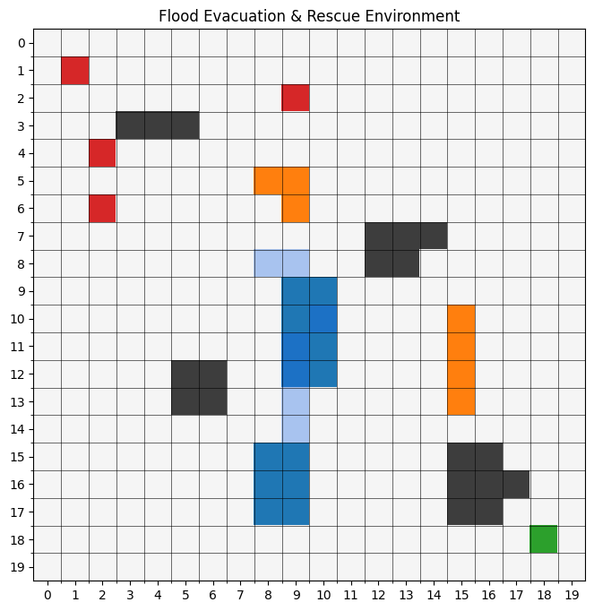

**BFS Pathfinding**
| Stage 2: Victim Found | Stage 3: Full Rescue |
|---|---|
|  |  |

**A* Pathfinding**
| Stage 2: Victim Found | Stage 3: Full Rescue |
|---|---|
|  |  |

**Risk-Based A* (Flood-Aware)**
| Stage 2: Victim Found | Stage 3: Full Rescue |
|---|---|
|  |  |

**Hill Climbing (Dynamic Re-routing)**
| Stage 2: Victim Found | Stage 3: Full Rescue |
|---|---|
| 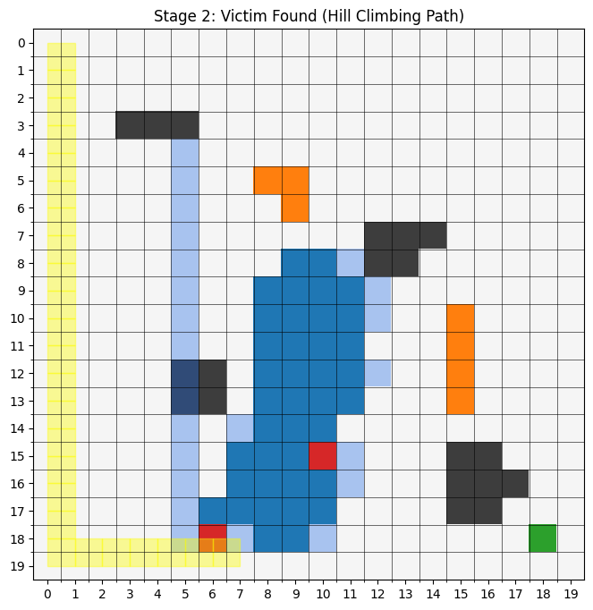 |  |

---

## Machine Learning Models

| Model | Task | Target | Accuracy |
|---|---|---|---|
| Decision Tree | Zone Classification | `zone_label` | ~95% |
| KNN + SMOTE | Rescue Detection | `rescue_needed` | F1: 0.93 |
| Naive Bayes | Flood Risk Probability | `zone_label` | ~40%* |
| ANN (MLP) | Zone Classification | `zone_label` | ~96% |

> *Naive Bayes accuracy drops without directly derived features — this intentionally demonstrates the model's limitation with correlated features, which is a key insight of this project.

### ML Model Visualizations

**Dataset Overview**
- Target Distributions  
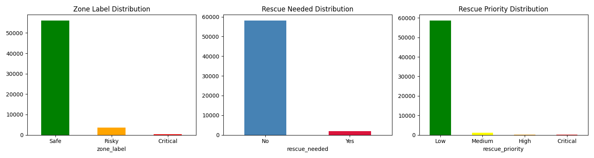

- Feature Correlations  


- Water Level Distribution by Zone  
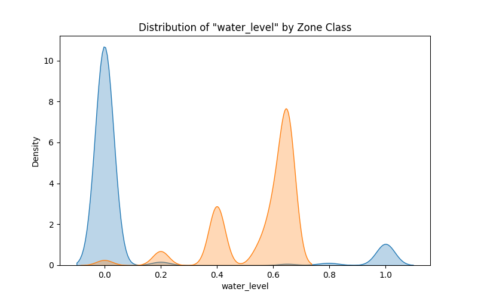

**Decision Tree Model**
| Feature Importances | Tree Visualization | Confusion Matrix |
|---|---|---|
| 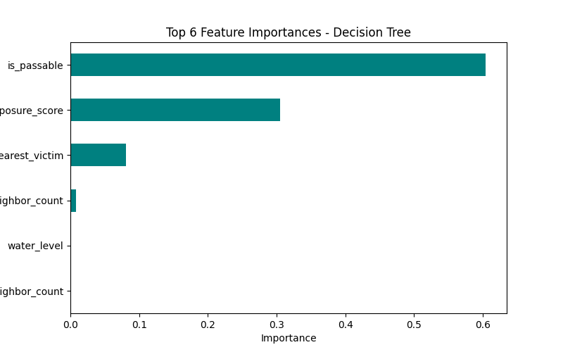 | 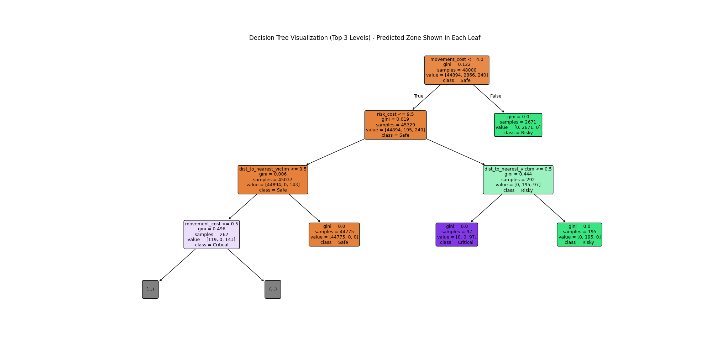 | 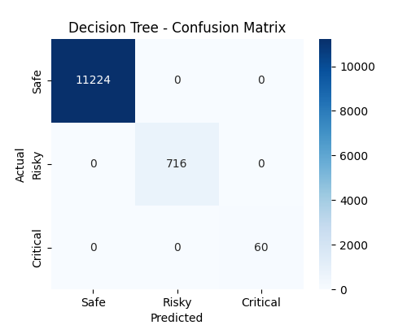 |

**KNN Model**
| K Value Optimization | Confusion Matrix |
|---|---|
| 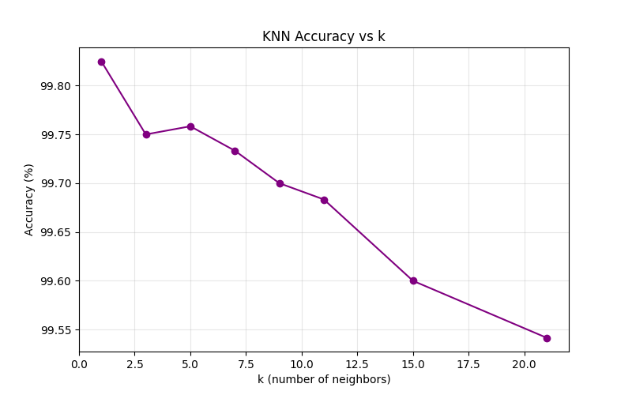 | 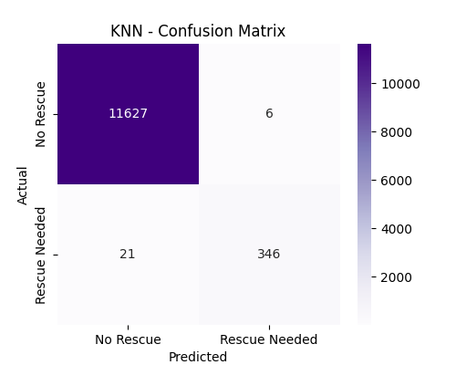 |

**Naive Bayes Model**
| Probability Distribution | Confusion Matrix |
|---|---|
| 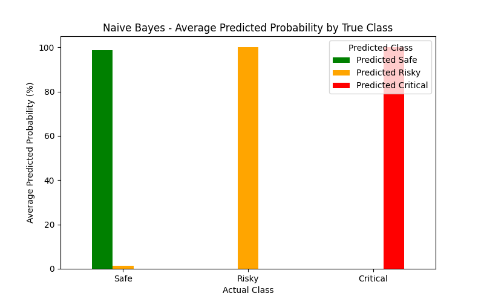 | 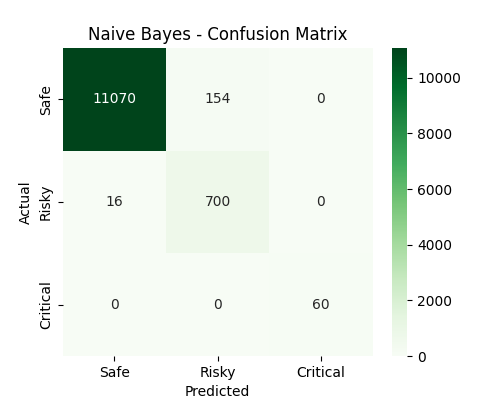 |

**ANN (MLP) Model**
| Network Architecture | Training Progress | Confusion Matrix |
|---|---|---|
| 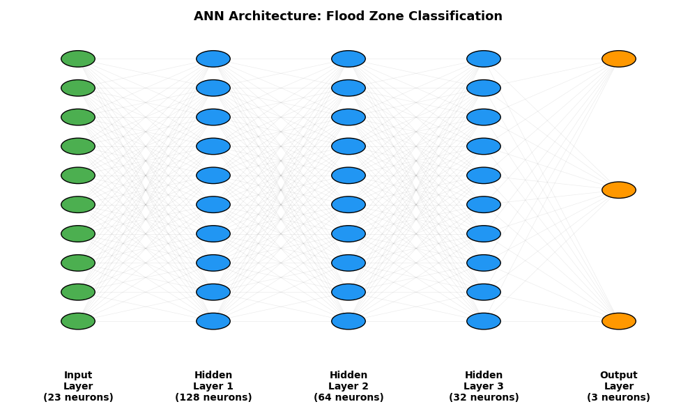 | 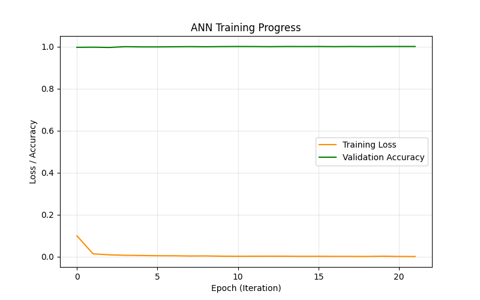 | 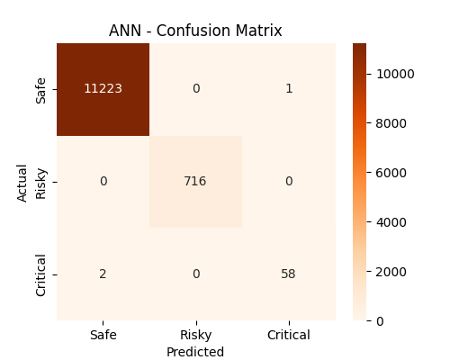 |

**Model Performance Comparison**
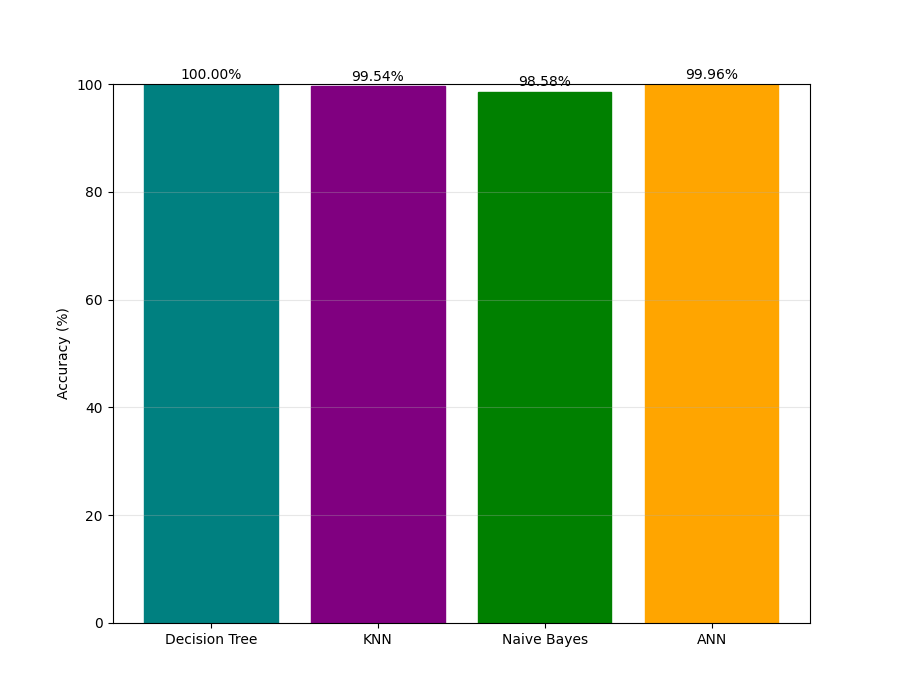

**Dimensionality Reduction (PCA)**
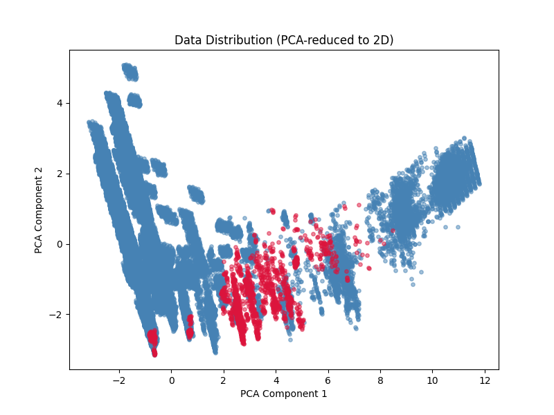

### Dataset
- **60,000 rows × 33 columns** generated from flood simulation
- Features include: water level, neighbor counts, distances, victim attributes
- Labels: `zone_label`, `rescue_needed`, `rescue_priority`
- Class imbalance addressed using **SMOTE** for rescue detection

---

## Project Structure

```
Flood-Evacuation-and-Rescue-Management-System/
│
├── gui.py                          # Desktop GUI application (Tkinter)
├── App.py                          # Web app (Streamlit)
│
├── Environment/
│   └── grid.py                     # Grid setup, flood spread, helpers
│
├── Dataset/
│   ├── generate-dataset.py         # Dataset generator from simulation
│   └── flood_dataset.csv           # Generated dataset (60,000 rows)
│
├── Models/
│   ├── decision_tree.pkl           # Trained Decision Tree
│   ├── knn_model.pkl               # Trained KNN model
│   ├── knn_scaler.pkl              # KNN StandardScaler
│   ├── naive_bayes.pkl             # Trained Naive Bayes
│   ├── nb_scaler.pkl               # Naive Bayes StandardScaler
│   ├── ann_model.pkl               # Trained ANN (MLP)
│   ├── ann_scaler.pkl              # ANN StandardScaler
│   └── features.pkl                # Feature list used during training
│
├── Algorithms/
│   ├── bfs.ipynb                   # BFS implementation & visualization
│   ├── A-star.ipynb                # A* implementation & visualization
│   ├── RiskBased-A-star.ipynb      # Risk-Based A* notebook
│   └── Hill-Climbing.ipynb         # Hill Climbing notebook
│
├── notebook/
│   ├── flood-evacuation-&-rescue-analysis.ipynb   # ML training & analysis
│   └── Diagrams/                                  # ML model visualizations
│       ├── target_distributions.png
│       ├── correlation_heatmap(dataset).png
│       ├── water_level_distribution_by_zone.png
│       ├── feature_importances_decision_tree.png
│       ├── decision_tree_visualization.png
│       ├── confusion_matrix_decision_tree.png
│       ├── knn_accuracy_vs_k.png
│       ├── knn_error_rate_vs_k.png
│       ├── confusion_matrix_knn.png
│       ├── naive_bayes_avg_predicted_probability.png
│       ├── confusion_matrix_naive_bayes.png
│       ├── ann_architecture.png
│       ├── ann_training_progress.png
│       ├── confusion_matrix_ann.png
│       ├── model_comparison_accuracy.png
│       ├── pca_scatter_plot.png
│       └── flood_risk_level_distribution_by_zone.png
│
├── images/
│   ├── flood_environment.png       # Initial flood grid
│   ├── stage2_victim_found_BFS.png # BFS stage 2 visualization
│   ├── stage3_full_rescue_BFS.png  # BFS stage 3 visualization
│   ├── astar_stage2_victim_found.png       # A* stage 2 visualization
│   ├── astar_stage3_full_rescue.png        # A* stage 3 visualization
│   ├── risk_astar_stage2_victim_found.png  # Risk-Based A* stage 2
│   ├── risk_astar_stage3_full_rescue.png   # Risk-Based A* stage 3
│   ├── hill_climb_stage2_victim_found.png  # Hill Climbing stage 2
│   └── hill_climb_stage3_full_rescue.png   # Hill Climbing stage 3
│
├── requirements.txt                # Python dependencies
└── README.md                       # This file
```

---

## Setup & Installation

### 1. Clone the repository
```bash
git clone https://github.com/RadhikaKapoor383/Flood-Evacuation-and-Rescue-Management-System.git
cd Flood-Evacuation-and-Rescue-Management-System
```

### 2. Install dependencies
```bash
pip install -r requirements.txt
```

### 3. Run the GUI
```bash
python gui.py
```

### 4. Run the ML Notebook (optional)
Open `notebook/flood-evacuation-&-rescue-analysis.ipynb` in Jupyter Notebook.

---

## Requirements

```
pandas
numpy
scikit-learn
imbalanced-learn
matplotlib
seaborn
```

---

## Key Design Decisions

- **Two-array grid architecture** — separate arrays for cell type and water level preserve nuance for ML feature extraction
- **Dataset from environment** — training data generated directly from simulation, with the simulator acting as the labeling oracle
- **SMOTE for class imbalance** — rescue cases are rare (~3%) so synthetic oversampling ensures the KNN model doesn't ignore them
- **Data leakage fix** — derived features (`movement_cost`, `risk_cost`, `exposure_score`, `safety_margin`, `flood_risk_level`) removed from training to ensure genuine learning

---


## Performance Metrics
| Model | Accuracy | Precision | Recall | F1-Score |
|---|---|---|---|---|
| Decision Tree (Zone Classification) | ~95% | 0.95 | 0.95 | 0.95 |
| KNN + SMOTE (Rescue Detection) | ~93% | 0.92 | 0.94 | 0.93 |
| Naive Bayes (Flood Risk Probability) | ~40% | 0.38 | 0.42 | 0.40 |
| ANN (MLP) (Zone Classification) | ~96% | 0.96 | 0.96 | 0.96 |
